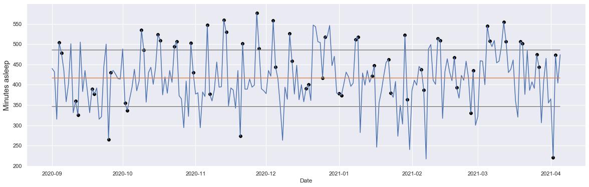

Motivations
-------

This project is special for me as it is the first time that I analyse data... on myself. I have bought a Samsung Galaxy Watch Active 2 which was at first intended to tracking my sport sessions. But I ended up focusing more on tracking my sleep data.

I also came across a book called "Why We Sleep" written by Matthew Walker which was fascinating and helped me a lot understanding my sleep and what I should do in the future to improve it.

Sources
-------

Explanation on sleep stages using the Samsung watch: *https://developer.samsung.com/health/server/partner-only/api-reference/data-types/sleep-stage.html*

This helped me building stacked bar charts: *https://towardsdatascience.com/stacked-bar-charts-with-pythons-matplotlib-f4020e4eb4a7*

The "Why We Sleep" amazing book that you should read: *https://tinyurl.com/whywesleepbook*

The code
-------

Click [here](https://github.com/SalimAmarti/Sleep_Analysis/blob/master/Sleep%20analysis.ipynb) to view the code.

Executive Summary
-------

- I sleep more on weekends than during work days (7h31 vs. 6h42 on average)
- My sleep time is quite anarchic, with a standard deviation of 1h10

  

- Small correlation between the number of steps during a day and the amount of REM/deep sleep I get
- Small correlation between coding late at night and rapidity to fall asleep: the later I code, the quicker I fall asleep at night
- Sleeping early has a positive impact on REM sleep and also increases my total sleep
- It looks like the most efficient sleep duration for me would be between 9h and 10h (to get enough deep and REM sleep)
- I have an average sleep efficiency of 89% which can be considered as good-quality sleep

Approach
-------

I read "Why We Sleep" from Matthew Walker which helped me to understand sleep, sleep phases, and how I could improve my sleep. 
Based on my new knowledge from the book, I built an analysis using my sleep data. I spent a lot of time reprocessing the raw data from the Samsung Galaxy Watch Active 2 (reprocessing time zones, date and hour formats, sleep stages, etc.). Then I tried to dry out the dataset and find as many meaningful insights as possible.

Next steps / Improvements
-------

- I would like to spend more time on collecting external factors data:
  - Time spent on my computer
  - Time spent on my phone
  - Time spent working out
  - The kind of activity I was doing before going to sleep: computer/TV vs. reading a book
  - etc.
- Then relate this data with my sleep data and see how correlated these external factors could be

Infographics
-------

WIP
